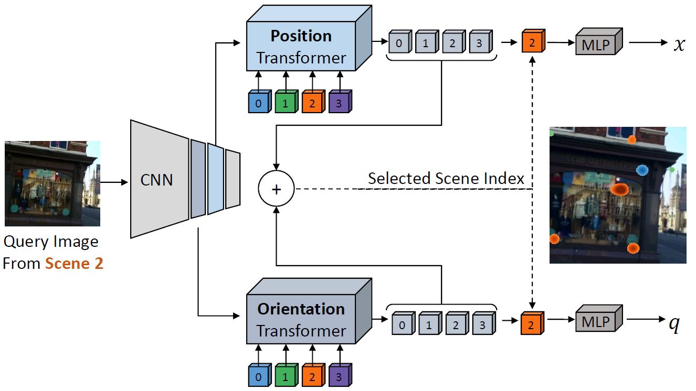

## Learning Multi-Scene Camera Pose Regression with Transformers

This is a PyTorch implementation of a multi-scene camera pose regression paradigm with Transformers described in our paper:
**Learning Multi-Scene Absolute Pose Regression with Transformers** 

The figure below illustrates our approach to multi-scene absolute pose regression with Transformers. 
Two Transformers separately attend to position-  and orientation- informative features from a convolutional backbone. Scene-specific queries (0-3) are further encoded with aggregated activation maps into latent representations, from which a
single output is selected. The strongest response, shown as an overlaid color-coded heatmap of attention weights, is obtained with the output associated with the input image's scene. The selected outputs are used to regress the position x and the orientation q.  



---

### In a Nutshell

This code implements:

1. Training of a Transformer-based architecture for multi-scene absolute pose regression 
2. Training of a PoseNet-like (CNN based) architecture for single scene pose regression
3. Testing of the models implemented in 1-2

---

### Prerequisites

In order to run this repository you will need:

1. Python3 (tested with Python 3.7.7)
1. PyTorch deep learning framework (tested with version 1.0.0)
1. Use torch==1.4.0, torchvision==0.5.0
1. Download the [Cambridge Landmarks(http://mi.eng.cam.ac.uk/projects/relocalisation/#dataset)] dataset and the [[7Scenes](https://www.microsoft.com/en-us/research/project/rgb-d-dataset-7-scenes/)] dataset:

---

### Usage

The entry point for training and testing is the main.py script in the root directory

  For detailed explanation of the options run:
  ```
  python main.py -h
  ```
  For example, in order to train our model on the 7Scenes dataset run: 
  ```
python main.py ems-transposenet train /./models/backbones/efficient-net-b0.pth <path to the 7Scenes dataset> ./datasets/7Scenes/7scenes_all_scenes.csv
  ```
  Your checkpoints (.pth file saved based on the number you specify in the configuration file) and log file
  will be saved under an 'out' folder.
  
  To run on cambridge, you will need to change the configuration of ems-transposenet in config.json 
  with the relevant configuration from the example_config.json file (ems-transposenet-cambridge)
  
  In order to test your model, for example on the fire scene from the 7Scenes dataset:
  ```
  python main.py ems-transposenet train /./models/backbones/efficient-net-b0.pth <path to the 7Scenes dataset> ./datasets/7Scenes/abs_7scenes_pose.csv_fire_test.csv --checkpoint_path <path to your checkpoint .pth>
  ```
  
  
  
  
  
